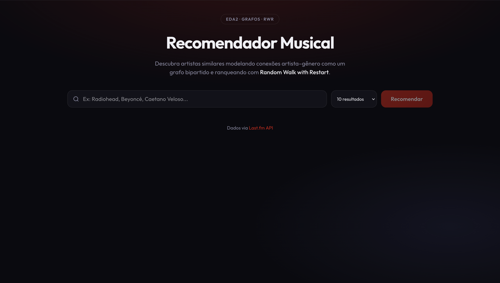
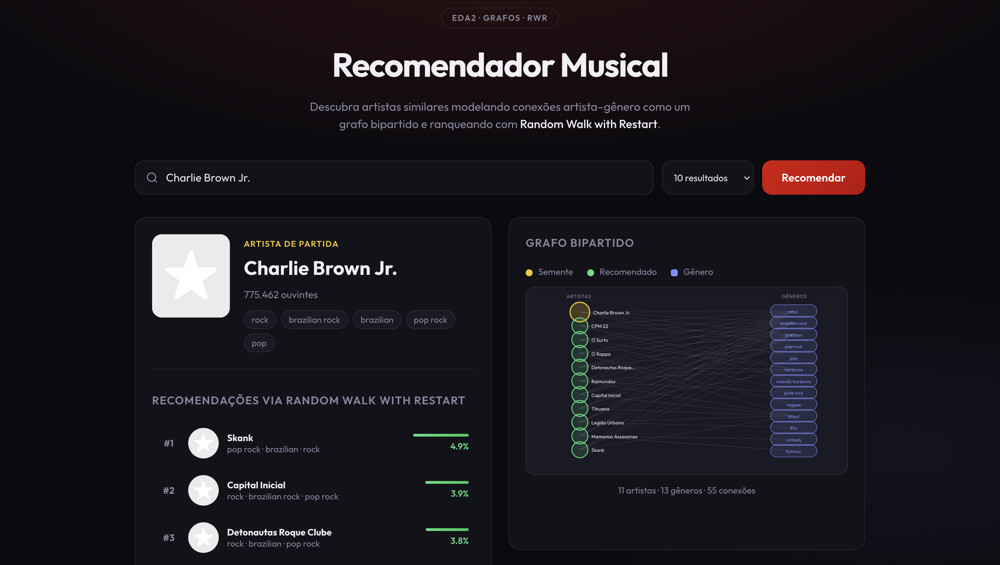
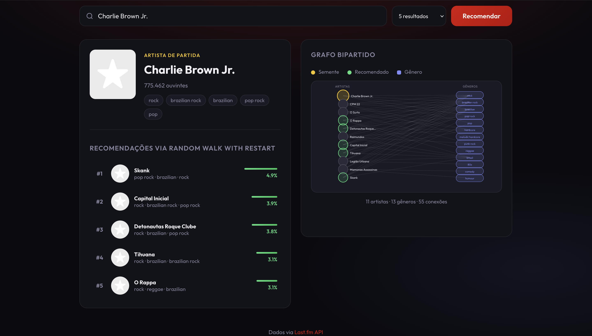

# G3_Grafos_EDA2-2026.1

## Grupo 3
|Matrícula | Aluno |
| -- | -- |
| 22/1022720  | Rayene Ferreira Almeida |
| 20/2017361  | Enzo Fernandes Borges   |

## Sobre 
O sistema é um recomendador musical que sugere artistas similares a partir de um artista de interesse, utilizando a API gratuita do [Last.fm](https://www.last.fm/api) e modelando a relação entre artistas e gêneros (tags) como um grafo bipartido. Através do algoritmo de Random Walk with Restart (uma variação do PageRank), o sistema caminha aleatoriamente pela rede de conexões musicais para identificar quais artistas são mais relevantes ao ponto de partida, revelando similaridades indiretas e sutis que métodos simples de filtragem por gênero não capturam. 

## Acesso Online

O sistema está disponível online em:
[https://recomendador-musical-1ink.onrender.com/](https://recomendador-musical-1ink.onrender.com/)

## Screenshots

  
   
  <em>Tela Inicial</em>

 

  
   
  <em>Resultados da Recomendação</em>

 

  
   
  <em>5 Recomendações com Grafo</em>

## Video

editar

  

  <b>Autores:</b>
  <a href="https://github.com/rayenealmeida">Rayene Almeida</a> e 
  <a href="https://github.com/enzo-fb">Enzo Fernandes</a>

